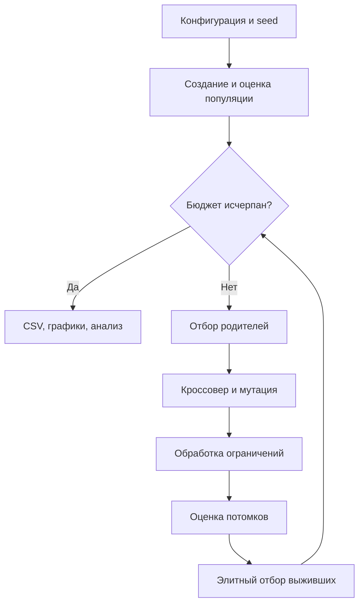

Оценки выживших кешируются: повторного обращения к целевой функции для них нет.
Для случайного baseline вместо отбора родителей и вариации генерируется новая выборка,
а сохраняется лучший найденный допустимый результат.
