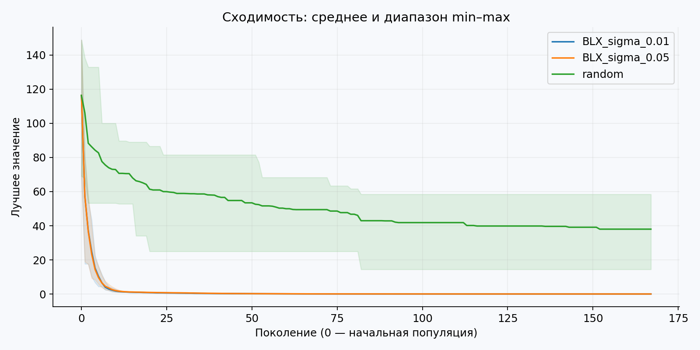
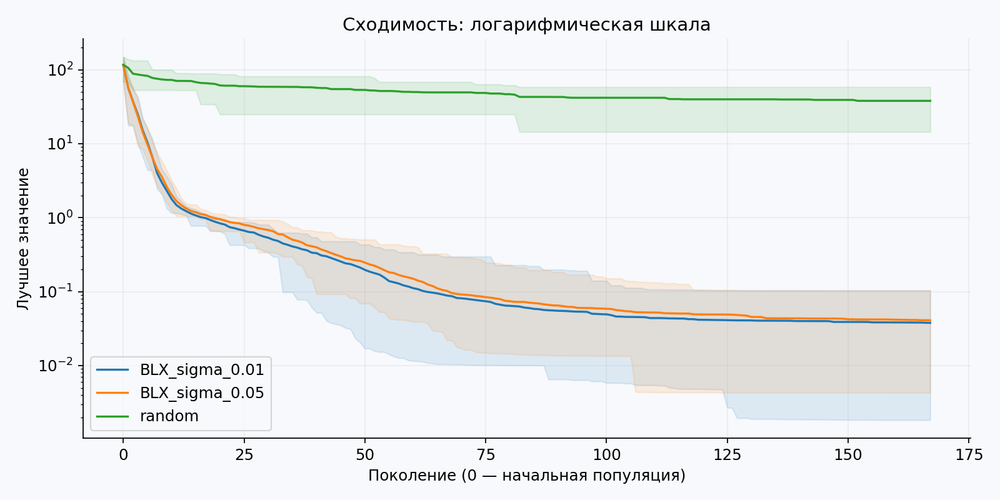
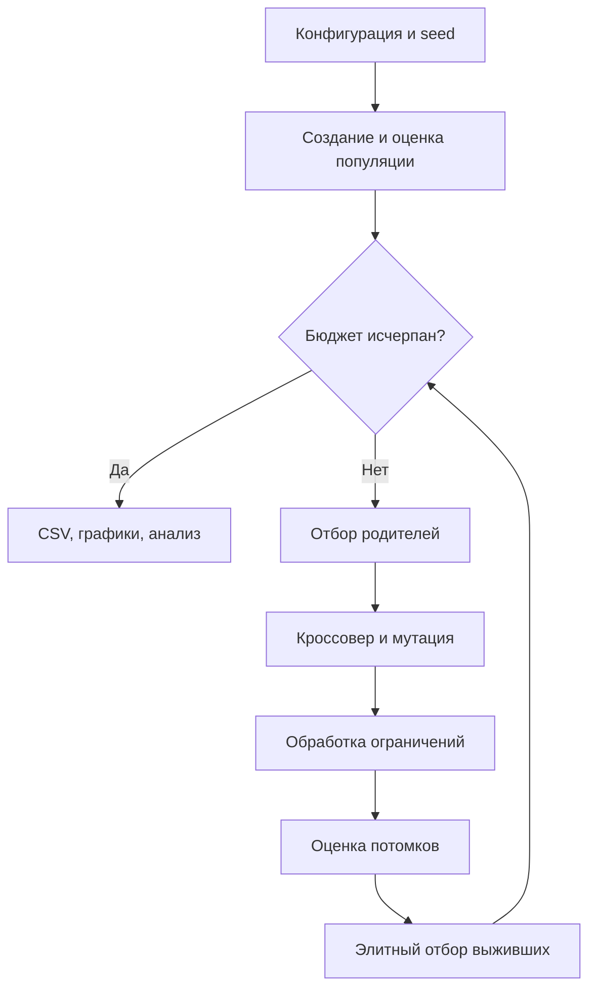

# Лабораторная работа № 1

Эволюционное программирование и генетические алгоритмы  
Группа **507**, порядковый номер **14**, год **2026**.

Индивидуализация: Q=0, Y=26; V=1+((17·14+7·0+26) mod 20)=**5**.

## Постановка и пространство решений

Найти минимум функции Гриванка в размерности d=5+(5 mod 6)=10:

$$f(x)=1+\frac{1}{4000}\sum_{i=1}^{10}x_i^2-\prod_{i=1}^{10}\cos\left(\frac{x_i}{\sqrt i}\right),\quad x_i\in[-600,600].$$

Генотип и фенотип совпадают: десять вещественных координат. Из квадратичной неотрицательной части и произведения косинусов ≤ 1 следует f≥0; при x=0 достигается глобальный минимум 0. Оптимум используется только для интерпретации, не подставляется в начальную популяцию.

Косинусное произведение создаёт множество локальных минимумов, а большой десятимерный диапазон делает случайное попадание в окрестность нуля маловероятным. Локальный поиск чувствителен к старту; ГА также не гарантирует глобального оптимума.

## Алгоритм и операторы

Равномерная инициализация 96 особей. Турнир размера 3 минимизирует f, поэтому не требует превращать отрицательные/малые значения в вероятности. BLX-α с α=0.3 независимо смешивает каждую координату: потомок может немного выходить за диапазон родителей. Вероятность кроссовера 0.9 на особь. Гауссовская мутация применяется с вероятностью 0.1 на координату. Её стандартное отклонение равно sigma·1200: 12 или 60 единиц. Выходы за границы отражаются, включая многократные выходы.

Выживают 96 лучших из родителей и 96 потомков, правило (μ+λ). Это сохраняет лучший результат, но может быстро уменьшать разнообразие. Все потомки оцениваются, даже если совпали с родителем. Остановка после 167 поколений: 96·168 = **16 128** оценок на запуск. Случайный поиск делает ровно столько же независимых равномерных выборок; на графике его «поколение» — очередной пакет из 96 точек.

## Эксперимент и вывод

20 seed на каждую конфигурацию. Между двумя ГА меняется только масштаб мутации. Средние конечные значения: **0.0378801** и **0.0409703**, случайный поиск — **38.0071**. Лучший результат меньшей мутации — **0.00183541**, но среднее и худшее значительно больше: нельзя подменять ими всю серию.

Меньшая мутация дала немного лучшее среднее, но большая — немного лучшую медиану (0.03466 против 0.03743). Разбросы перекрываются; строгого доказательства превосходства одного масштаба нет. Оба ГА явно лучше случайной выборки в этом эксперименте. Результат хорош относительно baseline, однако точное достижение глобального минимума не установлено; остаточная ошибка связана с локальными минимумами и потерей разнообразия.





В `best.json` даны координаты, значение и seed лучших решений каждого метода. График — фактические траектории всех запусков, не сглаженная иллюстрация. Возможные улучшения: адаптивный шаг и рестарты, сравниваемые при прежнем бюджете.

## Схема процесса



Оценки выживших кешируются: повторного обращения к целевой функции для них нет.
Для случайного baseline вместо отбора родителей и вариации генерируется новая выборка,
а сохраняется лучший найденный допустимый результат.


## Параметры приложенной серии

```json
{
  "population": 96,
  "generations": 167,
  "runs": 20,
  "seed": 261400,
  "dimension": 10,
  "lower": -600,
  "upper": 600,
  "crossover_probability": 0.9,
  "mutation_probability": 0.1,
  "scales": [
    0.01,
    0.05
  ]
}
```

Потоки генератора: seed от 261400 до 261419 включительно.
Независимость относится к запускам на одном фиксированном экземпляре, а не к разным задачам.

## Полная сводная статистика

`std` — выборочное стандартное отклонение, ddof=1. min/max относятся к серии.
Для ошибки меньше — лучше, для полезности больше — лучше; extrema времени не являются показателями качества.

| Метод | Метрика | n | min | Среднее | Медиана | std | max |
|---|---|---|---|---|---|---|---|
| BLX_sigma_0.01 | best | 20 | 0.00183541 | 0.0378801 | 0.0374261 | 0.0252683 | 0.104125 |
| BLX_sigma_0.01 | seconds | 20 | 0.018472 | 0.0209538 | 0.0201383 | 0.00301192 | 0.031273 |
| BLX_sigma_0.01 | evaluations | 20 | 16128 | 16128 | 16128 | 0 | 16128 |
| BLX_sigma_0.05 | best | 20 | 0.00430956 | 0.0409703 | 0.0346596 | 0.0275515 | 0.103534 |
| BLX_sigma_0.05 | seconds | 20 | 0.0173021 | 0.0190157 | 0.0186367 | 0.00141855 | 0.0229598 |
| BLX_sigma_0.05 | evaluations | 20 | 16128 | 16128 | 16128 | 0 | 16128 |
| random | best | 20 | 14.4506 | 38.0071 | 37.7317 | 9.25171 | 58.4426 |
| random | seconds | 20 | 0.00638272 | 0.00647758 | 0.00642007 | 0.000257619 | 0.007563 |
| random | evaluations | 20 | 16128 | 16128 | 16128 | 0 | 16128 |

## Проверка и воспроизводимость

В приложенной среде завершились полная серия и `python -m unittest discover -s tests -v`.
Протокол — `results/tests.log`. Исходные строки — `runs.csv`, промежуточные траектории —
`histories.csv`, параметры — `used_config.json`, версии — `environment.json`.
Время измерялось на общей машине с параллельно выполнявшимися независимыми экспериментами;
оно ориентировочное и не используется как основание превосходства методов.

Сравнивались средние, медианы и разбросы. Проверка статистической значимости не проводилась;
слова «лучше» в отчёте относятся к наблюдаемой серии, а не к доказанному универсальному превосходству.
